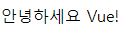
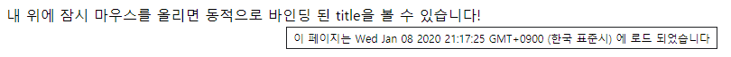

# 시작하기

## Vue.js 란

사용자 인터페이스를 만들기 위한 **프로그레시브 프레임워크**. 점진적으로 채택할 수 있도록 설계되어 있다. 정교한 단일 페이지 응용프로그램을 완벽하게 지원할 수 있다.

## 시작하기

가장 단순한 방법으로 `index.html`파일을 만들고 javascript library를 포함하는 것을 들 수 있다.

```html
<!-- 개발버전, 도움되는 콘솔 경고를 포함. -->
<script src="https://cdn.jsdelivr.net/npm/vue/dist/vue.js"></script>
```

또는:

```html
<!-- 상용버전, 속도와 용량이 최적화됨. -->
<script src="https://cdn.jsdelivr.net/npm/vue"></script>
```

*(다른 설치 방법도 있다.)*

## 선언적 렌더링

간단한 템플릿 구문을 사용하여 DOM에서 데이터를 선언적으로 렌더링 할 수있는 시스템.

```html
<div id="app">
  {{ message }}
</div>
```

```js
var app = new Vue({
  el: '#app',
  data: {
    message: '안녕하세요 Vue!'
  }
})
```

| 실행                                                         |
| ------------------------------------------------------------ |
|  |

텍스트 보간 이외에 엘리먼트 속성을 바인딩하기.

```html
<div id="app-2">
  <span v-bind:title="message">
    내 위에 잠시 마우스를 올리면 동적으로 바인딩 된 title을 볼 수 있습니다!
  </span>
</div>
```

```js
var app2 = new Vue({
  el: '#app-2',
  data: {
    message: '이 페이지는 ' + new Date() + ' 에 로드 되었습니다'
  }
})
```

| 실행                                                         |
| ------------------------------------------------------------ |
|  |

